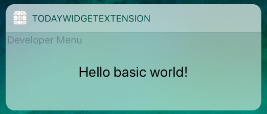

# Basic example of Today widget using RN

Created by `react-native init Basic` command followed by `yarn add react-native-today-widget` and `react-native link`.

React Native version: `0.54.0`

Changes only in [index.js](./index.js) and added file [TodayWidget.js](./TodayWidget.js).

