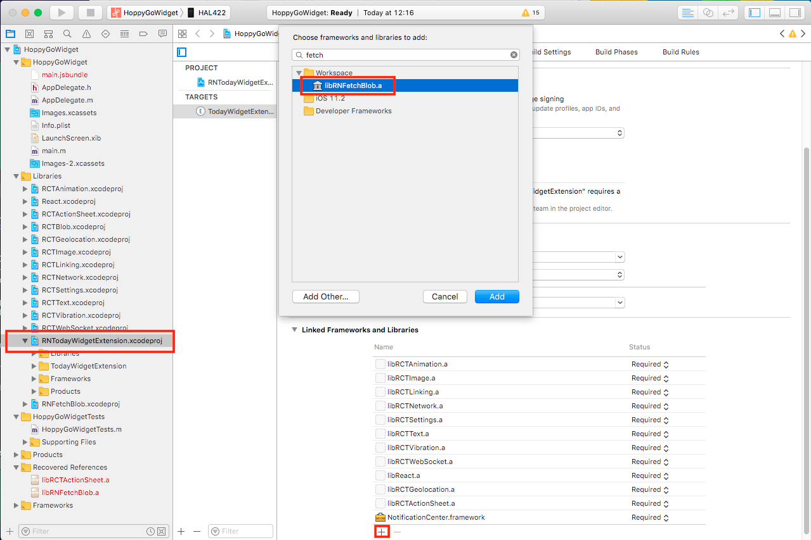
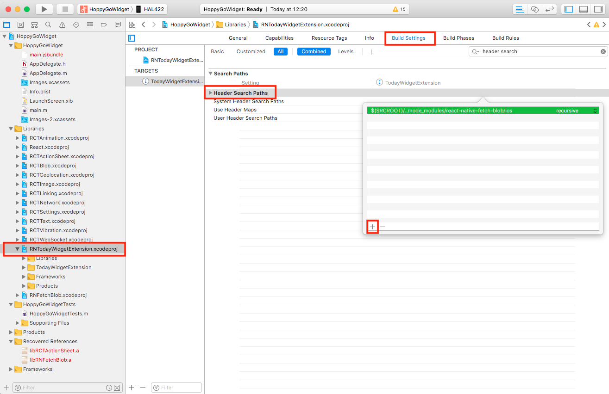
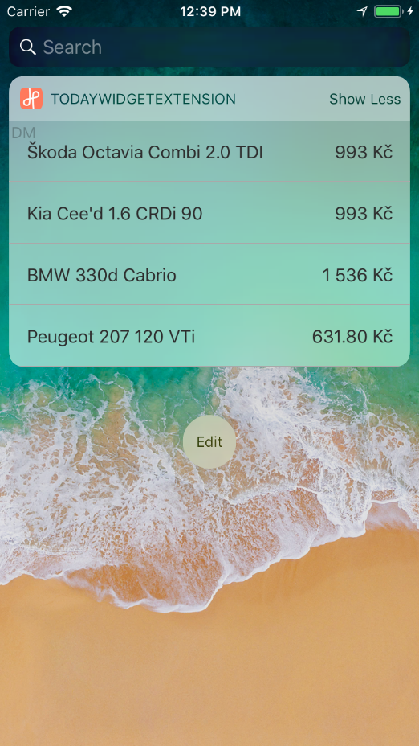
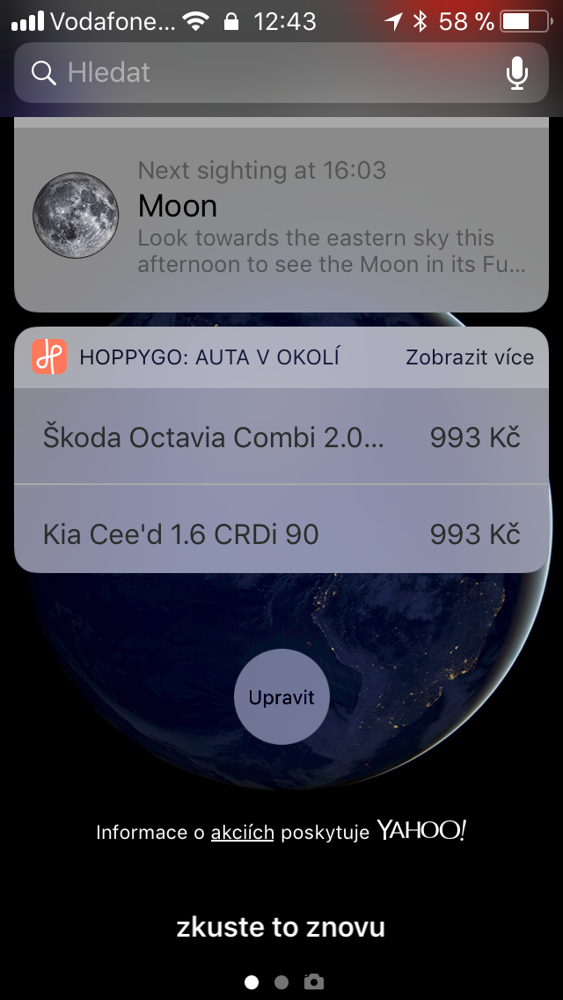

## Steps to run:

1. `git clone https://github.com/matejkriz/react-native-today-widget.git`

2. `cd react-native-today-widget/Examples/Complex/`

3. `yarn`

4. `open ios/HoppyGoWidget.xcodeproj/`

   Manually link `native-fetch-blob` to
   `./node_modules/react-native-today-widget/ios/RNTodayWidgetExtension.xcodeproj`:

   1. Add `libRNFetchBlob.a` to Linked Frameworks and Libraries:
      

   2. Add `$(SRCROOT)/../node_modules/react-native-fetch-blob/ios` to Header
      Search Paths as `recursive`:
      

5. `react-native run-ios`

## Screenshots:

On lock screen, Debug mode, simulator iPhone 8, iOS 11.2:

On force touch, Debug mode, simulatoriPhone 8, iOS 11.2:

On lock screen, Release mode, real device - iPhone 5s, iOS 11.2

