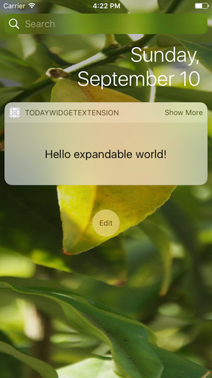
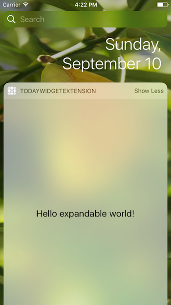

# Example of expandable Today widget using RN

Created by `react-native init Basic` command followed by `yarn add react-native-today-widget` and `react-native link`.

React Native version: `0.48.2`

Changes only in [index.ios.js](./index.ios.js)

 
